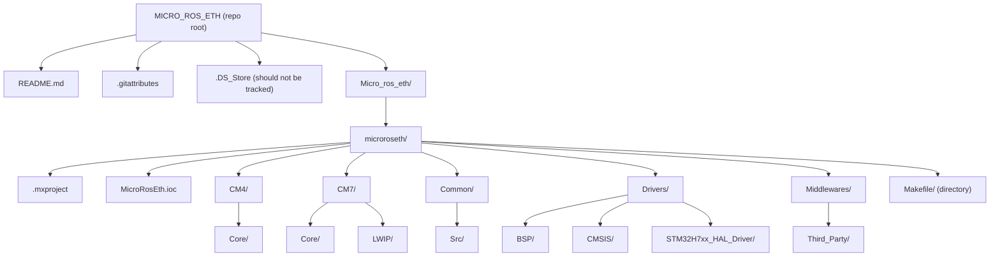

# MICRO_ROS_ETH

## Code structure (2 levels)

```mermaid
graph TD
  ROOT["MICRO_ROS_ETH (repo root)"]

  ROOT --> README["README.md"]
  ROOT --> GATTR[".gitattributes"]
  ROOT --> DSROOT[".DS_Store (should not be tracked)"]
  ROOT --> MRE["Micro_ros_eth/"]

  MRE --> PKG["microroseth/"]

  PKG --> MX[".mxproject"]
  PKG --> IOC["MicroRosEth.ioc"]

  PKG --> CM4["CM4/"]
  PKG --> CM7["CM7/"]
  PKG --> COMMON["Common/"]
  PKG --> DRIVERS["Drivers/"]
  PKG --> MW["Middlewares/"]
  PKG --> MK["Makefile/ (directory)"]

  %% 2nd level
  CM4 --> CM4_CORE["Core/"]

  CM7 --> CM7_CORE["Core/"]
  CM7 --> CM7_LWIP["LWIP/"]

  COMMON --> COMMON_SRC["Src/"]

  DRIVERS --> DRV_BSP["BSP/"]
  DRIVERS --> DRV_CMSIS["CMSIS/"]
  DRIVERS --> DRV_HAL["STM32H7xx_HAL_Driver/"]

  MW --> MW_TP["Third_Party/"]
```
