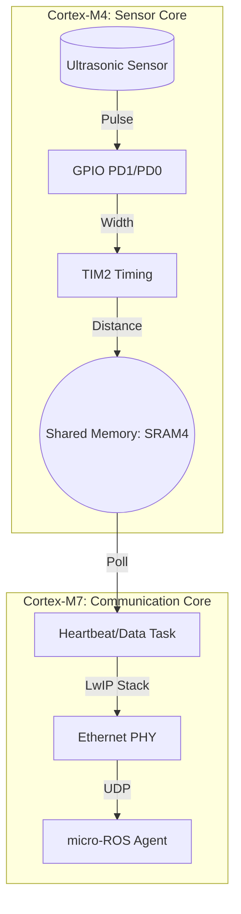

# Dual-Core Architecture Explanation

This document explains the internal architecture of the micro-ROS Ethernet project and how the two Cortex-M cores (CM7 and CM4) cooperate.

## Overview
The STM32H747/H743 series features a dual-core architecture. This project leverages both cores to separate high-speed networking from timing-critical hardware sensing.



## Cortex-M4 (CM4) - The Sensor Specialist
The CM4 core is dedicated to low-level hardware interaction.
- **Responsibility**: Triggering the ultrasonic sensor and measuring the echo pulse width using `TIM2`.
- **Timing**: It uses a busy-wait/polling mechanism for microsecond precision (`TRIG_PULSE_TIME_US`).
- **Communication**: It writes the calculated distance (in cm) into a specific address in **SRAM4** (`0x38000000`).

## Cortex-M7 (CM7) - The Network Master
The CM7 core handles the complex middleware and communication stacks.
- **Operating System**: Runs **FreeRTOS** to manage multiple tasks (Networking, ROS, LEDs).
- **Networking**: Implements the **LwIP** stack over Ethernet.
- **Middleware**: Runs the **micro-ROS (RCLC)** stack to communicate with the ROS 2 ecosystem.
- **Interaction**: A dedicated `SensorData` task polls the shared memory at `0x38000000`. When `data_ready` is detected, it consumes the distance measurement.

## Inter-Processor Communication (IPC)
The communication is handled via **Shared RAM** (SRAM4, located in the D3 domain), which is accessible by both cores.

### Data Protocol (`shared_data.h`)
The protocol is defined in `Common/Inc/shared_data.h`:
```c
typedef struct {
  volatile uint32_t distance_cm;   // Shared distance value
  volatile uint32_t data_ready;    // Semaphore-like flag (1=new data)
} SharedData_t;

#define SHARED_DATA ((SharedData_t *)0x38000000U)
```

1. **CM4** calculates distance, writes to `distance_cm`, and sets `data_ready = 1`.
2. **CM4** executes a Data Synchronization Barrier (`__DSB`) to ensure the write completes.
3. **CM7** checks `data_ready`. If `1`, it reads `distance_cm` and clears `data_ready = 0`.

## Memory Map Considerations
- **SRAM4 (0x38000000)**: Used for the shared data structure. This region is ideal because it resides in the D3 domain, which is persistent and accessible during various low-power modes.
- **VectTab**: CM7 boots from `0x08000000`, while CM4 is configured to boot from `0x08100000`.
